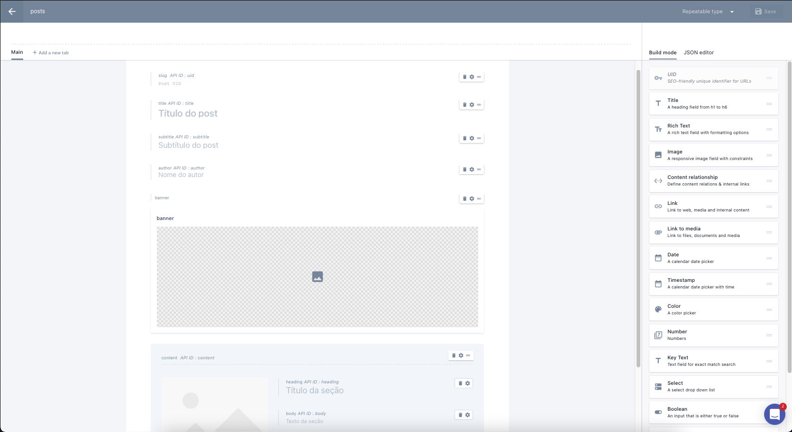
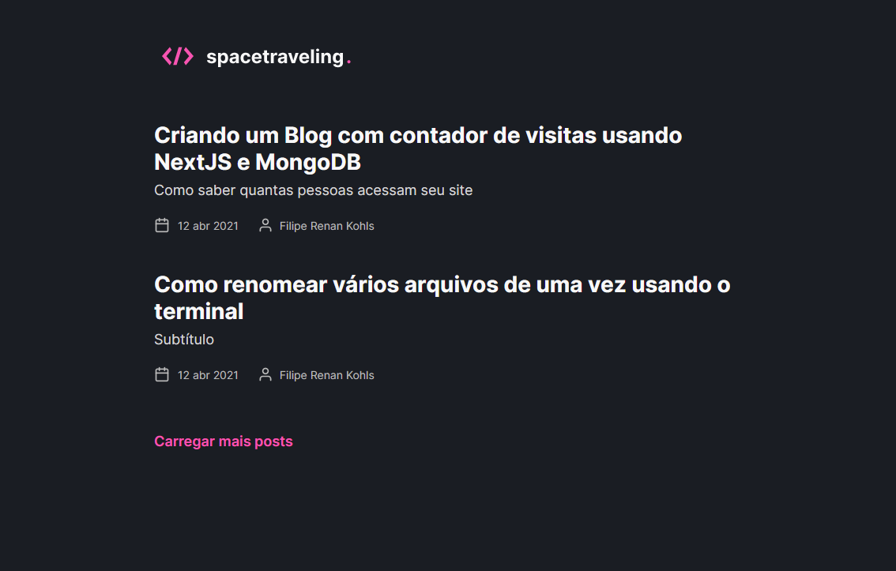
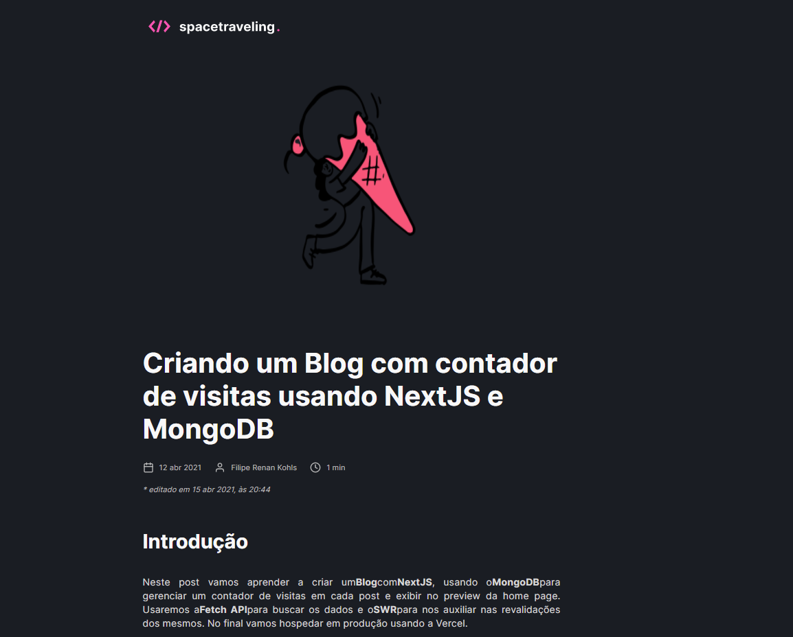
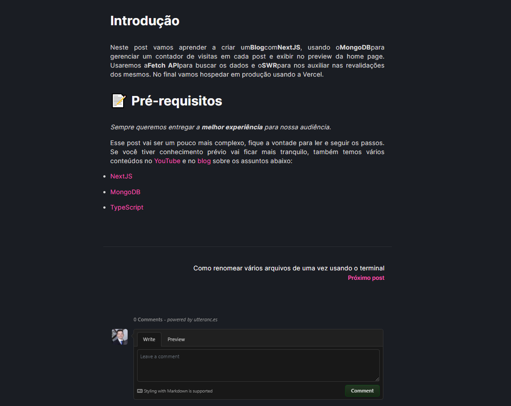

<h3 align="center">
  Desafio 5 - Spacetraveling - Criando um projeto do zero
</h3>

## Descrição
Aplicação desenvolvida durante o terceiro módulo do Ignite da [Rocketseat](https://app.rocketseat.com.br/dashboard)</h2>. </p>
Essa aplicação foi desenvolvida com o intuito de simular um blog de posts criados em um CMS, que neste caso foi o Prismic CMS.

## Funcionalidades
- Consumir os posts criados no Prismic CMS
- Listar os posts
- Ao clicar em um post, mostrar as informações do post, além de: data de criação, data de modificação, autor e tempo estimado de leitura
- Ao final do post, ter a opção de navegação para "próximo post" e "post anterior".
- Comentários sobre o post com Utteranc.es (Ao efetuar um comentário, o mesmo aparecerá como uma issue do post no repositório do github).

<h2> Tecnologias utilizadas: </h2>

- <a href="https://nextjs.org" > Next.js </a>
- <a href="https://www.typescriptlang.org/"> TypeScript </a>
- <a href="https://sass-lang.com"> SASS </a>
- <a href="https://prismic.io"> Prismic CMS </a>

# Iniciando

Essas instruções fornecerão uma cópia do projeto completo instalado e funcionando em sua máquina local para fins de desenvolvimento e teste.

O projeto deve ser compilado com npm ou yarn, então faça o download abaixo se você não tiver nenhum instalado em seu sistema.

O Npm é distribuído com o Node.js, o que significa que quando você faz o download do Node.js, o npm é instalado automaticamente no seu computador.

Yarn é um gerenciador de pacotes criado pela equipe do Facebook e parece ser mais rápido do que o npm em geral.

Para executar este servidor, você precisará de um nó versão 12.0.0 (mínimo).

## Prismic

[Prismic](https://prismic.io) é um Sistema de Gerenciamento de Conteúdo, uma ferramenta para edição de conteúdo online.

Você deve criar uma conta e um novo tipo de postagem com este formato:



Finalmente, você deve renomear o arquivo `.env.example` para `.env.local`, e preencher as informações abaixo com seus respectivos valores que você encontrará nas configurações da sua conta no Prismic.

```js
PRISMIC_API_ENDPOINT= // Api endpoint
PRISMIC_ACCESS_TOKEN= // Token
```

## 💻 Instalação da aplicação
- `https://github.com/FilipeRK/Ignite-Challenge05-SpaceTraveling.git` para clonar o repositório

<br>

# Executar a aplicação
Para executar o aplicativo na web, siga as instruções do seu terminal:
- `cd Ignite-Challenge05-SpaceTraveling` e `code .`
- execute `yarn` para instalar as dependências do projeto
- Renomeie o arquvo `.env.example` para `.env.local`
- Depois disso, execute `yarn dev` para executar o aplicativo, que será aberto no endereço `localhost:3000`
<br>

# Picture of runing application
- Página inicial (Posts)

- Detalhes de um post (parte 1)

- Detalhes de um post (parte 2)


<p >Developed by <a href="https://github.com/FilipeRK">Filipe Kohls </a>
